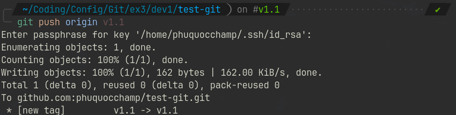
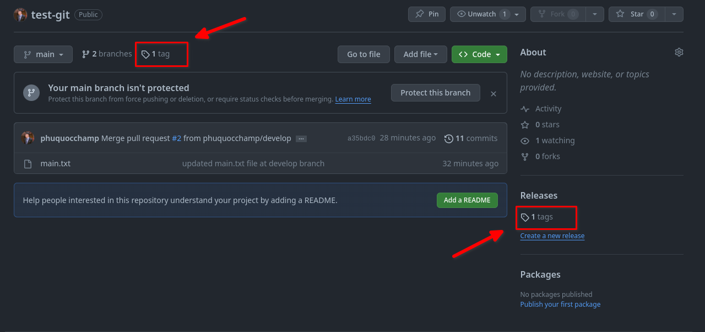
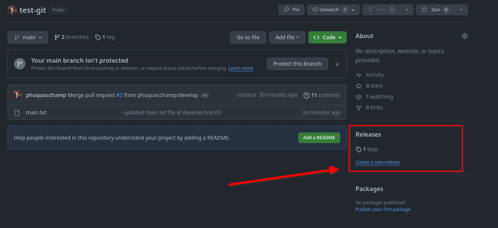
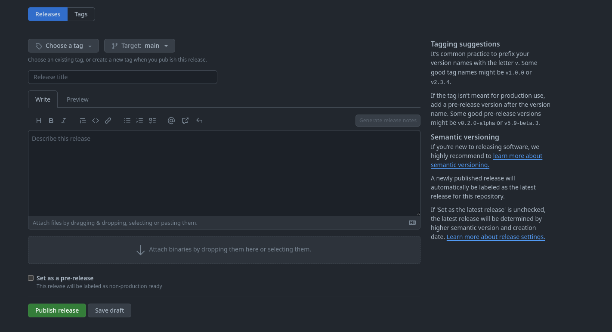
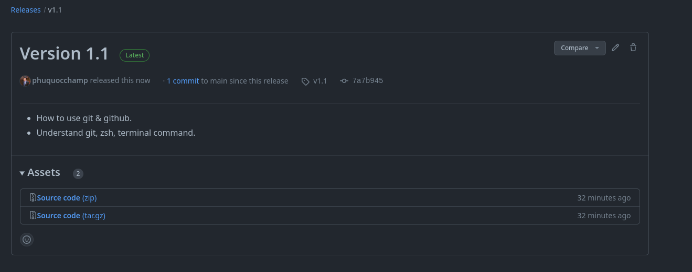

### GIT COMMON COMMAND BY PHUQUOCCHAMP

#### git init

##### 1. git init

Lệnh `git init` được sử dụng để khởi tạo một kho lưu trữ Git trong thư mục làm việc hiện tại. Khi bạn chạy lệnh này, Git tạo ra một thư mục `.git` ẩn trong thư mục làm việc. Thư mục `.git` này chứa toàn bộ lịch sử commit, các thông tin về nhánh, tag, và các cài đặt khác của kho lưu trữ Git.

Cú pháp:

```bash
git init
```

Khi đã chạy lệnh này, bạn có thể thêm tệp tin và thực hiện các commit trong thư mục làm việc của bạn.

##### 2. git init --bare

Ngược lại, lựa chọn `--bare` khi sử dụng `git init` tạo ra một kho lưu trữ Git không có thư mục làm việc làm trung gian. Kho lưu trữ "bare" chỉ chứa dữ liệu Git mà không có bất kỳ bản sao làm việc hoặc thư mục làm việc cụ thể. Kho lưu trữ "bare" thường được sử dụng khi bạn muốn tạo ra một kho lưu trữ tập trung mà nhiều người có thể chia sẻ.

Cú pháp:

```bash
git init --bare <name_repo>
```

Kho lưu trữ "bare" thường được sử dụng trên máy chủ từ xa, nơi mà mọi người có thể đẩy (push) và kéo (pull) từ đó mà không làm việc trực tiếp trong thư mục `.git`. Kho lưu trữ "bare" không có một thư mục làm việc để chứa các tệp làm việc thông thường, và nó chỉ chứa các đối tượng Git, refs và các thông tin liên quan đến lịch sử commit.

#### git status

Lệnh git status dùng để kiểm tra trạng thái của các file, thư mục trong working area và staging area

```bash
git status
```

#### git add

Thêm thay đổi từ working area sang staging area

Thêm một tập tin cụ thể.

```bash
git add [file]
```

Thêm tất cả thay đổi trong working area.

```bash
git add .
```

#### git tag

Git tag dùng để đánh dấu một điểm cụ thể trong lịch sử commit, thường là một phiên bản cố định hoặc một điểm cụ thể trong dự án. Các tag giúp dễ dàng theo dõi và chuyển đến các phiên bản cụ thể của mã nguồn.

##### Cú pháp:

```bash
git tag -a [tag_name] [commit_hash] -m [commit_message]
```

> **Note:** *Hash commit nếu để trống thì git sẽ lấy mặc định là commit mới nhất*

Ví dụ:

```bash
git tag -a v1.0 -m "Version 1.0"
```

> Note: ở đây ta chỉ đánh dấu tag ở local, bây giờ nếu ta push code lên remote repo (github, gitlab) thì không xuất hiện tag ở trên remote repo.

##### Xem danh sách các tag

Cú pháp

```bash
git tag
```

##### Đẩy tag lên remote repo

Cú pháp

```bash
git push origin [ten_tag]
```

Ví dụ 

```bash
git push origin v1.0
```





**Lúc này ở remote repo (Github)**



##### Release (Phiên bản phát hành Github)

Khi chúng ta tạo các tag cho các commit thì ta có thể tạo các **release (phiên bản phát hành)**. Mục đích của việc tạo release là để chia sẻ và đóng gói ứng dụng, cùng các ghi chú phát hành và các link tới các file tài liệu ứng dụng cho người trong team, công ty có thể sử dụng.

Release dựa trên git tag, nó đánh dấu một điểm cụ thể ở lịch sử repository của chúng ta. Các release được sắp xếp theo thời gian chúng được tạo trên github



Ta có thể thêm các thông tin như title, description cho phiên bản release của chúng ta.



Release sau khi điền một số thông tin cần thiết.


